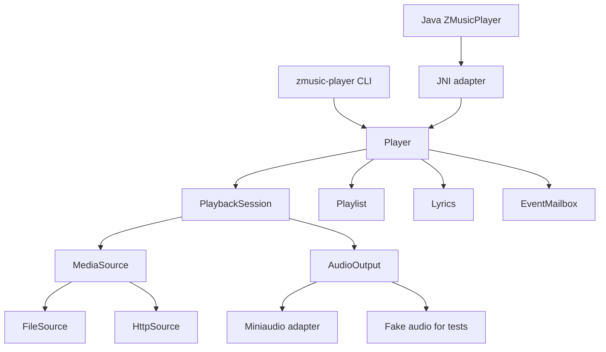

# ZMusic Player Rust 重构方案

状态：实施中，Rust 已成为构建和发布默认实现，Zig 保留为回归基线

日期：2026-07-24

范围：将 Zig 播放器核心迁移到 Rust，保持 Java 调用方式、miniaudio 音频引擎和跨平台产物兼容。

## 1. 结论

建议采用**带决策门槛的渐进式 Rust 迁移**，不进行一次性全量重写。

迁移理由主要是长期维护性和 AI 辅助开发效率，而不是现有 Zig 实现已经无法继续维护：

- Rust 的语言、标准工具链、JNI、HTTP 和测试资料更丰富，AI 生成和修正代码时更容易收敛。
- Rust 所有权和线程安全检查能够降低播放器资源、下载线程、JNI 句柄等生命周期错误的概率。
- Cargo 的依赖、测试和工程约定更统一，减少 Zig 版本变化和项目特定构建知识带来的维护成本。
- 当前项目仍处于 alpha，代码规模和外部兼容负担较小，现在迁移比发布稳定版本后迁移便宜。

但 Rust 不会自动解决 miniaudio C FFI、音频实时线程、跨平台链接和网络取消问题。因此必须先完成一个覆盖最高风险链路的原型。原型未通过时停止迁移，继续维护 Zig。

## 2. 当前实现评估

### 2.1 可保留的设计

- `Player` 是唯一公共入口，Java 和 CLI 不需要理解内部子系统。
- 播放状态使用明确枚举，状态码已经和 Java 侧固定值对齐。
- miniaudio 作为唯一音频后端，减少了平台音频差异。
- 平台差异集中在 `src/platform.zig`。
- 播放队列和歌词解析已有较完整的单元测试。
- CI 已覆盖 Linux、Windows、macOS ARM64 和 macOS x86_64。

这些设计应迁移，不应因为换语言而重新定义产品行为。

### 2.2 主要维护风险

#### 播放职责集中但内部耦合较高

`src/player.zig` 同时管理状态机、miniaudio 资源、网络流、播放队列、歌词和事件。公共入口合理，但音频资源与网络生命周期缺少可替换的测试入口，导致最危险的行为只能依赖真实环境验证。

#### 网络实现不是真正的有界流式缓冲

当前网络播放先通过 HEAD 获取 `Content-Length`，然后按完整文件大小分配内存。其影响包括：

- 不支持没有 `Content-Length` 的响应。
- 大文件占用与文件大小线性增长。
- 分块传输和持续流媒体难以支持。
- 下载取消仍依赖阻塞网络读取最终返回。
- 解码读取回调需要等待网络数据，可能影响音频线程。

这些属于设计问题，迁移时必须显式修正，不能逐行翻译。

#### JNI 实现承担了较多不安全细节

当前 JNI 层手写 vtable 索引、字符串转换和裸指针句柄。每个导出函数都要重复处理参数、句柄和错误路径。轮询线程与销毁操作之间的时序也需要集成测试证明安全。

#### 事件槽可能覆盖事件

当前每个播放器只有一个原子事件值。新事件到达时会覆盖尚未轮询的旧事件，无法保证多个状态变化、错误和结束事件都被观察到。

#### 测试没有覆盖最高风险路径

现有 Player 测试明确不调用真实播放，因此以下行为缺少自动验证：

- miniaudio 初始化、播放、停止和销毁。
- HTTP 下载、缓冲、断线和取消。
- JNI 字符串、句柄、多实例和销毁竞态。
- 事件顺序和事件积压。
- 真实动态库被 Java 加载后的行为。

### 2.3 语言迁移收益判断

| 维度 | 继续 Zig | 迁移 Rust | 判断 |
| --- | --- | --- | --- |
| 当前交付成本 | 低 | 高 | Zig 占优 |
| 长期维护和人员供给 | 中 | 高 | Rust 占优 |
| AI 辅助开发 | 中低 | 高 | Rust 占优 |
| C/miniaudio 互操作 | 高 | 高，但需要 `unsafe` | 接近 |
| 生命周期与并发检查 | 中 | 高 | Rust 占优 |
| 跨平台构建直接性 | 高 | 中高 | Zig 略占优 |
| 网络、JNI、测试生态 | 中 | 高 | Rust 占优 |
| 重写和行为回归风险 | 无新增 | 高 | Zig 占优 |

如果目标只是短期完成个人播放器，应继续使用 Zig。如果目标是长期维护、主要依靠 AI 开发并逐步增加能力，Rust 的长期收益更高。

## 3. 重构目标

### 3.1 必须实现

- 保持现有 Java 公开方法和 JNI 方法名称兼容。
- 保持 `System.loadLibrary("zmusic")` 不变。
- 保持状态码、事件码和循环模式数值不变。
- 保持本地文件和 HTTP/HTTPS 播放能力。
- 保持歌词、播放队列、随机播放和循环模式行为。
- 保持 Linux、Windows、macOS ARM64、macOS x86_64 构建产物。
- 网络缓冲改为固定上限，不再按完整文件大小分配。
- `stop` 和 `destroy` 必须能够有界取消网络播放。
- JNI 句柄无效、重复销毁、负数参数和空字符串不得导致未定义行为。
- Rust panic 不得跨越 JNI 或 C FFI。
- 核心状态机可以在没有音频设备、网络和 JVM 的情况下测试。

### 3.2 本次不做

- 不更换 miniaudio。
- 不重新设计 Java 公开接口。
- 不增加新的音频格式、均衡器、播放列表持久化等功能。
- 不引入 GUI。
- 不同时重写上层 ZMusic 服务。
- 不为了未来可能出现的后端预先创建大量抽象。
- 不在迁移期间删除可工作的 Zig 实现。

## 4. 必须冻结的兼容契约

正式编写 Rust 产品代码前，先将以下行为固化为黑盒测试。

### 4.1 产物契约

- Java 加载名：`zmusic`。
- Linux：`libzmusic.so`。
- Windows：`zmusic.dll`。
- macOS：`libzmusic.dylib`。
- CLI 名称：`zmusic-player`。

### 4.2 JNI 契约

保留 `Java_me_zhenxin_zmusic_ZMusicPlayer_*` 导出函数以及现有参数和返回类型。现有 Java 文件中的 27 个 native 方法是第一版兼容清单。

### 4.3 数值契约

播放状态：

| 名称 | 数值 |
| --- | ---: |
| stopped | 0 |
| loading | 1 |
| playing | 2 |
| paused | 3 |
| error | 4 |

事件：

| 名称 | 数值 |
| --- | ---: |
| none | 0 |
| state_changed | 1 |
| track_ended | 2 |
| progress_update | 3 |
| error | 4 |
| buffering | 5 |

循环模式：`none = 0`、`one = 1`、`all = 2`。

### 4.4 行为契约

- 音量输入限制在 `[0.0, 1.0]`。
- 负数 seek、负数队列索引和非法循环模式返回失败或产生错误事件，不崩溃。
- `stop` 可重复调用。
- `destroy` 后不再允许底层资源被轮询线程访问。
- 多个 Player 实例的状态、事件、队列和歌词互不影响。
- Java 字符串必须正确处理中文和补充平面 Unicode 字符，不依赖手写 JNI 修改版 UTF-8 细节。

### 4.5 CLI 交互契约

- 命令保持为 `zmusic-player play <URL或路径> [--lyrics <LRC路径或URL>] [--volume <0-100>]`，默认音量为 20%。
- 交互式终端必须进入原始模式；Space、`q` 和方向键按下后立即生效，不要求输入命令或按 Enter。
- Space 暂停/恢复，`q` 停止并退出，左右方向键快退/快进 5 秒，上下方向键增减 10% 音量。
- 播放界面保持三行原地刷新：亚字符进度条、状态/时间/音量/歌词、按键提示。
- `--lyrics` 保持本地文件和 HTTP(S) 来源，并兼容 UTF-8 与 GBK。
- 无参数、未知命令、缺少播放源和参数解析错误保持 Zig 的提示文本与成功退出行为；实际播放或网络失败仍以非零状态退出。
- 迁移观察期继续保留 Zig 的参数边界行为：`u8` 范围内超过 100 的音量最终钳制为 100%，未知尾随参数忽略。若要收紧参数校验，应作为独立行为变更评审。

语言迁移和内部架构重构不授权修改上述可观察行为。任何有意变更都必须单独说明、单独测试并经用户确认。

当前未被测试证明的行为不能直接视为兼容契约。若 Zig 与目标设计冲突，应先明确它是需要保留的行为还是现有缺陷。

## 5. 目标架构



### 5.1 Player

`Player` 仍是核心公开入口，负责：

- 验证状态转换。
- 管理当前 `PlaybackSession`。
- 协调播放队列和歌词。
- 产生领域事件。
- 对 JNI 和 CLI 隐藏音频、网络和线程细节。

`Player` 不直接执行 HTTP 请求，也不直接管理 miniaudio 裸指针。

### 5.2 PlaybackSession

每次播放创建一个播放会话，集中拥有：

- 当前媒体来源。
- miniaudio sound、decoder 和相关 FFI 资源。
- 下载任务及其取消状态。
- 当前播放位置、总时长和缓冲状态。
- 停止和销毁顺序。

会话结束后一次性释放资源，避免 `Player` 内出现多个互相关联的可空字段。

### 5.3 MediaSource

只保留两个实际实现，因此该替换点有明确价值：

- `FileSource`：本地文件。
- `HttpSource`：HTTP/HTTPS 有界流式读取。

测试使用内存来源验证解码读取、seek 和错误路径。无需为尚不存在的协议创建扩展框架。

### 5.4 AudioOutput

- 生产实现使用 miniaudio。
- 测试实现记录命令、进度和资源释放，不打开音频设备。

miniaudio 的所有 `unsafe`、C 回调、返回码转换和资源释放集中在一个 Rust 模块中。

### 5.5 EventMailbox

事件从单值原子槽改为每实例有界邮箱：

- 状态、结束、错误事件按顺序保留。
- 高频进度事件允许合并，只保留最新值。
- 队列满时必须有明确策略和测试，不允许静默覆盖关键事件。
- 音频回调不得直接调用 JNI、分配内存或执行网络 I/O。
- 当前 miniaudio pull decoder 的读取回调是受控例外：读取缓冲时会持有短期互斥锁，缺少数据时以 100ms 窗口等待条件变量，并可由取消和下载状态变化立即唤醒。原型验证表明，简单返回 `MA_BUSY` 会被 decoder 当作流结束，不能用它替代等待。
- 若后续需要满足严格的硬实时约束，应引入独立异步解码层；在该方案完成前，不宣称当前回调完全无锁或完全不等待。

### 5.6 JNI adapter

JNI 模块只负责：

- Java 类型与 Rust 类型转换。
- 句柄创建、查询和失效。
- 参数验证。
- 返回码和事件码映射。
- 捕获 panic，禁止展开穿过 FFI。

句柄不得直接信任任意 `jlong` 为有效裸指针。风险原型需要在“受控句柄表”和“经过严格生命周期约束的指针句柄”之间选择，默认优先受控句柄表。

## 6. Rust 工程布局

项目当前使用一个 Cargo package，同时构建动态库和 CLI：

```text
Cargo.toml
build.rs
native/
├── miniaudio_shim.c
└── miniaudio_shim.h
rust/src/
├── lib.rs
├── player.rs
├── state.rs
├── event.rs
├── queue.rs
├── lyrics.rs
├── stream.rs
├── audio.rs
├── jni_bridge.rs
└── bin/
    └── zmusic-player.rs
tests/
├── online_playback.rs
├── truncated_http.rs
└── java/
```

Rust 源码放在 `rust/src/`，现有 `src/` 保留给 Zig 回归实现。观察期结束前不调整这两个目录，避免路径迁移与语言迁移混在一起。

## 7. 关键技术决策

### 7.1 工具链

- 使用项目级 `mise.toml` 固定 Rust 1.97.1 和 Zig 0.16.0，不修改全局运行时。
- 迁移观察期内不删除 Zig 工具链声明。
- 提交 `Cargo.lock`，保证应用构建可复现。
- CI 在目标操作系统原生 runner 上构建，不把交叉链接复杂度强行集中到 Linux。

### 7.2 miniaudio 集成

- 保留当前固定提交的 miniaudio 子模块。
- `build.rs` 使用 `cc` 编译 `miniaudio.c` 和最小 C shim，并链接各平台系统库。
- C shim 只暴露播放器实际使用的不透明 Engine、Sound 和流回调接口，不引入 bindgen 或本机 libclang 依赖。
- Rust FFI 声明和 RAII 封装集中在 `rust/src/audio.rs`；升级 miniaudio 时单独审查 shim 与构建结果。

Linux 端到端链路已验证。Windows MSVC 已在 Linux 上通过 `cargo-xwin` 完成 Release 交叉编译和链接，并在 Windows 原生终端及 Zulu JDK 21 中验证 CLI、27 个 JNI 导出、1000 次生命周期和在线 MP3 完整链路。Linux 上的 macOS 交叉构建受 Apple SDK 缺失限制，两个 macOS 架构仍必须由原生 CI runner 证明能够编译和链接。

### 7.3 HTTP 流式播放

当前使用 reqwest 异步流式接口和 Rustls TLS，显式选择 Ring crypto provider 以缩减静态产物。每个 HTTP 播放会话在独立下载线程中运行单线程 Tokio runtime，不要求调用方或整个播放器常驻共享异步 runtime。选择依据：

- 支持重定向、分块传输和缺失 `Content-Length`。
- 支持连接和读取超时。
- 可以在停止播放时有界取消。
- Windows 和 macOS 不依赖额外 OpenSSL 安装。
- `Notify` 能够直接取消正在等待响应头或正文 chunk 的异步操作。

下载线程启动时会一次性安装 Ring provider；线程入口捕获 panic 并立即转换为 `NetworkUnavailable`，避免后台任务异常后让前台一直等到初始缓冲超时。

实现采用 4 MiB 固定上限缓冲区；后续只能根据基准测试调整，不暴露为公共配置。

解码读取在数据不足时的行为已经通过 miniaudio 原型验证：当前 pull decoder 不能用 `MA_BUSY` 表示“稍后重试”，否则会把暂时缺少数据解释为流结束。因此实现使用条件变量进行有界窗口等待，状态变化和取消会主动唤醒；这属于已知的实时性折中，而不是硬实时无锁设计。若要彻底消除等待，需要增加独立异步解码层并重新验证 seek、EOF 和错误语义。

HTTP 超时分层设置：响应头等待 2 秒，正文连续 15 秒没有新数据才判定停滞；连接建立由客户端设置 10 秒上限。取消不依赖短读取超时，而是通过 Tokio `Notify` 同时中断响应头和正文等待。

### 7.4 并发与生命周期

必须满足以下不变量：

- 每个 Player 的可变状态只有一种同步规则。
- 不在持有 Player 状态锁时执行网络 I/O、线程 join 或 JNI 调用。
- `PlaybackSession` 独占其 miniaudio 资源，其他模块不能直接释放。
- 取消标记能够在不获取长时间锁的情况下设置。
- `stop` 先发出取消，再等待资源退出，等待时间有上限。
- `destroy` 阻止新调用，等待正在执行的调用结束，然后释放句柄。
- 音频回调不分配、不记录高开销日志、不调用 JVM、不进行网络操作。

### 7.5 错误模型

Rust 内部使用明确错误枚举，至少区分：

- 无效参数和无效状态。
- 网络、HTTP 状态、超时和取消。
- 解码失败和不支持格式。
- 音频设备初始化和播放失败。
- 队列和歌词错误。
- JNI 转换和句柄错误。

JNI 第一阶段继续映射到现有 `0/-1` 和事件码，不借迁移之机修改 Java 接口。更丰富的 Java 错误类型应单独设计版本。

## 8. 迁移阶段

### 阶段 0：建立 Zig 行为基线

工作：

- 初始化 miniaudio 子模块并保证当前 Zig 构建可重复执行。
- 为现有 Java native 方法建立兼容清单。
- 添加固定的小型 WAV/MP3 测试资源。
- 添加本地 HTTP 测试服务器，覆盖正常、慢速、断线、重定向和分块响应。
- 记录当前动态库大小、启动时间、空闲内存和首次播放延迟。
- 将现有缺陷与必须兼容的行为分开记录。

验证：

- Zig 单元测试通过。
- 四个平台构建通过。
- Java 能加载 Zig 动态库并完成生命周期冒烟测试。

退出条件：没有可执行的行为基线时，不开始 Rust 产品迁移。

### 阶段 1：Rust 风险原型

只实现以下最短链路：

```text
Java nativeInit
  -> Rust handle
  -> 本地文件播放
  -> HTTP 流式播放
  -> pause / seek / stop
  -> pollEvent
  -> destroy
```

工作：

- 构建 Rust `cdylib` 并导出少量现有 JNI 名称。
- 编译和链接 miniaudio。
- 实现一个固定容量网络缓冲和取消路径。
- 验证中文及补充平面 Unicode 字符转换。
- 在现有四平台 CI 矩阵构建。

通过门槛：

- 四个平台都能产出可加载动态库。
- Linux 上完成 Java 到 Rust 到 miniaudio 的端到端执行。
- 慢速或停滞 HTTP 连接中，`stop` 和 `destroy` 在 1 秒内返回。
- 网络缓冲不会随媒体文件大小增长。
- 反复初始化、播放、停止、销毁 1000 次无崩溃和明显资源增长。
- 没有 panic 跨 JNI，非法句柄不会触发未定义行为。

任一核心门槛无法以合理复杂度满足时，停止迁移并保留 Zig。歌词和播放队列不得用于替代该风险验证。

### 阶段 2：实现 Rust 核心状态机

工作：

- 实现 `Player`、`PlaybackSession`、状态枚举和错误枚举。
- 使用测试音频实现验证状态转换和资源释放。
- 实现 `EventMailbox`，明确关键事件与可合并事件。
- 建立无网络、无音频设备的核心单元测试。

验证：

- 正常状态转换、非法操作、错误恢复和重复 stop 测试通过。
- 多实例并发测试通过。
- 事件顺序、积压和进度合并测试通过。

### 阶段 3：完成媒体来源和 miniaudio 实现

工作：

- 完成本地文件来源。
- 完成 HTTP 分块读取、缓冲、超时、取消和错误传播。
- 完成 miniaudio decoder、sound、seek、position 和 duration。
- 将所有 C FFI 限制在音频模块中。

验证：

- 本地文件和 HTTP 测试资源行为一致。
- 覆盖无 Content-Length、重定向、提前断线、服务器停滞和取消。
- 自动测试确认资源释放顺序。
- 不依赖公网完成测试。

### 阶段 4：迁移 JNI 并运行双实现契约测试

工作：

- 实现全部现有 JNI 导出函数。
- 统一参数验证、句柄查找、字符串转换、错误映射和 panic 隔离。
- 调整 Java 内部轮询线程的停止与 join 时序，但不修改公开方法。
- 同一套 Java 黑盒测试分别加载 Zig 和 Rust 的 `libzmusic`。

验证：

- 27 个 native 方法全部有测试或明确不适用说明。
- 状态码、事件码、返回值和空值行为兼容。
- 多实例、重复 destroy、并发 poll/stop 测试通过。
- Java Unicode 往返测试通过。

### 阶段 5：迁移播放队列、歌词和 CLI

工作：

- 迁移播放队列及随机/循环行为。
- 迁移 LRC 解析、翻译配对、偏移和编码处理。
- 迁移 CLI，保持现有命令和基本交互。
- 将现有 Zig 单元测试案例转换为 Rust 测试。

验证：

- 所有现有队列和歌词案例在 Rust 中通过。
- 使用固定随机种子验证随机播放。
- CLI 能播放本地文件和本地 HTTP 测试资源。
- 真实 PTY 中逐一验证 Space、`q` 和四个方向键均无需 Enter，并确认退出后恢复终端模式和光标。

### 阶段 6：切换构建和发布

工作：

- CI 默认构建 Rust 动态库和 CLI。
- 保留独立 Zig 回归 job 一段观察期。
- 更新 README、AGENTS.md、构建命令和发布打包。
- 为最后一个 Zig 版本创建可回退标签。
- 一个预发布周期后再删除 Zig 实现和 Zig 构建配置。

退出条件：

- 四平台构建和契约测试连续稳定通过。
- Rust 产物通过真实 Java 应用验证。
- 没有未解释的内存增长、停止挂起或事件丢失。
- 已完成回退演练。

## 9. 验证矩阵

| 范围 | 验证方式 | 必须覆盖 |
| --- | --- | --- |
| 状态机 | Rust 单元测试 | 正常转换、非法操作、错误、重复停止 |
| 播放队列 | 单元和属性测试 | 空队列、边界索引、随机、三种循环模式 |
| 歌词 | 单元测试 | 多时间戳、偏移、翻译、Unicode、空行 |
| 网络 | 本地 HTTP 集成测试 | 分块、无长度、重定向、慢速、断线、取消 |
| miniaudio | 适配器测试和冒烟测试 | 初始化、解码、seek、停止、释放 |
| JNI | Java 黑盒测试 | 全部 native 方法、非法句柄、Unicode、多实例 |
| 生命周期 | 压力测试 | 1000 次 init/play/stop/destroy |
| 跨平台 | GitHub Actions | Linux、Windows、macOS ARM64/x86_64 |
| 发布 | 产物检查 | 文件名、可加载性、CLI、压缩包内容 |

建议的默认验收指标：

- 停滞网络中的 `stop`/`destroy`：不超过 1 秒。
- 单播放会话网络缓冲：不超过 4 MiB，除非基准测试证明需要调整。
- 关键事件：压力测试中零丢失；进度事件允许合并。
- Rust 动态库：初始目标不超过 Zig 基线的 2 倍，超出时必须解释。
- 空闲内存：相对 Zig 基线新增不超过 20 MiB。
- 本地文件首次播放延迟：相对 Zig 基线增加不超过 100ms。

这些数值是第一版工程门槛，阶段 0 得到真实基线后可以调整，但调整必须记录原因。

## 10. 双轨与回退方案

Rust 已是 Cargo 构建、CI 上传和 Release 打包的默认产品实现；Zig 保留为独立回归 job 和源码级回退基线。生产 Java 接口中不加入临时实现切换参数。

切换规则：

1. Rust 默认产物继续保持现有 27 个 JNI 方法、数值和库名契约。
2. 观察期内保留 Zig 构建 job、源码和最后可用产物。
3. 出现阻塞发布的 Rust 回归时，恢复 Zig 产物，不在发布分支现场修补两套实现。
4. 一个预发布周期稳定后，才删除 Zig 源码。
5. 删除 Zig 应作为单独提交，便于通过 Git 恢复。

## 11. 主要风险和应对

| 风险 | 影响 | 应对 |
| --- | --- | --- |
| Rust FFI 仍可能出现未定义行为 | 高 | `unsafe` 集中、最小化、逐函数安全说明和压力测试 |
| HTTP 取消仍被阻塞读取拖延 | 高 | 明确读取超时，原型验证停滞服务器，stop 设硬门槛 |
| 音频回调等待缓冲数据影响实时性 | 高 | 当前使用可取消的 100ms 条件变量窗口；已确认 `MA_BUSY` 不可直接代替，严格无锁需另建异步解码层 |
| Rust 构建在 Windows/macOS 失败 | 高 | 阶段 1 即进入四平台 CI，不推迟到迁移末期 |
| 行为测试把现有缺陷固化 | 中 | 阶段 0 分类“兼容行为”和“待修缺陷” |
| 依赖数量和产物体积膨胀 | 中 | 保持小依赖集合、关闭无用 feature、记录基线 |
| 双实现长期并存增加成本 | 中 | 每阶段有退出条件，正式迁移设置完成期限 |
| AI 生成过多抽象 | 中 | 单 package 起步，只为真实的生产/测试实现建立替换点 |

## 12. 原始工作量估算

假设一名熟悉 Rust 和 FFI 的开发者全职执行，并使用 AI 辅助编码：

| 阶段 | 估算 |
| --- | ---: |
| Zig 基线和契约测试 | 2-4 人日 |
| Rust 风险原型 | 4-7 人日 |
| 核心状态机和事件 | 4-6 人日 |
| 网络与 miniaudio 完整实现 | 6-10 人日 |
| JNI 迁移和双实现测试 | 4-7 人日 |
| 队列、歌词和 CLI | 3-5 人日 |
| 跨平台稳定、发布和回退 | 4-7 人日 |
| 合计 | 27-46 人日 |

即约 6-10 个工程周。AI 可以降低重复编码和测试迁移成本，但不能替代音频行为、FFI 安全和三平台产物验证。

## 13. 最终决策门槛

阶段 1 的 Linux 原型和完整功能迁移已通过，当前决策是继续 Rust，并已将其设为默认构建和发布实现。Windows MSVC 交叉构建、原生 CLI 和原生 JVM JNI 已通过；两个 macOS 架构仍必须由原生 CI 验证，CI 成功前不宣称四平台迁移完成。

### 继续迁移 Rust

必须同时满足：

- 四平台构建可行。
- JNI 和 miniaudio 端到端链路稳定。
- 网络停止和销毁满足 1 秒门槛。
- Rust 实现没有引入难以接受的运行时、体积或依赖复杂度。
- 团队确认未来主要维护语言改为 Rust。

### 停止迁移，继续 Zig

出现以下任一情况应停止：

- miniaudio Rust FFI 需要大量脆弱的自维护绑定。
- 三平台构建复杂度显著高于现状。
- 网络取消只能依赖复杂异步运行时且收益不足。
- Rust 产物或运行时开销无法接受。
- 团队没有持续维护 Rust `unsafe` 代码的能力。

停止迁移不等于原型失败。阶段 0 的契约测试、网络测试服务器和生命周期测试仍应保留，用于提高 Zig 实现的可靠性。

## 14. 剩余执行顺序

1. 推送后观察 GitHub Actions 的 Windows MSVC、macOS ARM64 和 macOS x86_64 原生构建与测试，重点补齐本机无法执行的 macOS 证据。
2. 在真实 ZMusic Java 应用中加载 Rust 发布产物，验证运行时部署路径和长期播放。
3. 发布一个预发布版本，观察停止延迟、内存增长、音频中断和错误事件。
4. 补齐阶段 0 尚未记录的 Zig/Rust 体积、内存和首次播放延迟基线，再决定是否调整验收指标。
5. 至少一个预发布周期稳定后，单独评估并单独提交 Zig 删除，不与其他功能修改混合。

本方案的核心不是“把 Zig 语法翻译成 Rust”，而是保留已经稳定的外部行为，同时重做网络缓冲、生命周期、事件投递和测试入口。只有这样，迁移才能产生长期维护收益。

## 15. 实施记录

截至 2026-07-24，已完成：

- Rust 1.97.1 单 package，可同时生成 `cdylib` 和 `zmusic-player` CLI。
- vendored miniaudio 0.11.25 的最小 C shim；Rust 侧通过 RAII 管理 Engine 和 Sound。
- 4 MiB 有界 HTTP 缓冲和 Range 重启；响应头超时 2 秒、正文停滞超时 15 秒，使用 Tokio `Notify` 即时取消。
- Player、PlaybackSession、状态、事件邮箱、队列和 LRC 歌词。
- 27 个兼容 JNI 导出、受控句柄表、panic 隔离和 Java 轮询线程安全销毁。
- Rust 单元测试、本地文件与 HTTP WAV 播放测试，以及无长度、chunked、重定向、750ms 正文间隔、Range、截断和取消等离线 HTTP 测试。
- 后台流错误在播放和暂停状态都会传播到 Player `Error`；CLI 遇到流错误会以失败状态退出。
- CLI 已恢复 Zig 的原始模式单键控制、三行原地刷新、20% 默认音量、`--lyrics` 本地/HTTP(S) 与 UTF-8/GBK 行为；参数与按键契约有单元测试，并在真实 Linux PTY 中逐一验证六个按键无需 Enter。
- Windows 原生终端已由用户确认 Space、`q` 和四个方向键的即时交互无回归；Windows 原生 JVM 输出 `JNI_SMOKE_OK` 和 `JNI_ONLINE_OK`。
- Java 黑盒测试覆盖全部 27 个 JNI 方法、无效参数与句柄、多实例隔离、轮询销毁和 1000 次完整 `init/play/stop/destroy` 生命周期。
- JNI 停滞 HTTP 下载销毁满足 1 秒门槛；指定在线 MP3 的 Rust 与 Java 生命周期测试显式运行。
- Cargo 默认构建/发布，四平台 CI 同时保留 Zig 回归构建。
- 提交前审计修复了 JNI 销毁持有全局句柄锁、重复启用 shuffle 未重新洗牌、CLI 参数错误行为漂移、Windows MSVC 产物误标 GNU 和 Unix 发布包丢失可执行位；Actions 工作流已通过 `actionlint`。
- Windows MSVC 使用静态 CRT，便携产物不再依赖外部 `VCRUNTIME140.dll`；依赖许可证元数据与 GPL-3.0-or-later 项目声明兼容。

Linux `ReleaseSmall` Zig 基线与 Rust size profile 的产物体积：

| 产物 | Zig | Rust | 比例 |
| --- | ---: | ---: | ---: |
| JNI 动态库 | 1,163,224 B | 3,339,584 B | 2.87x |
| CLI | 1,298,576 B | 2,833,792 B | 2.18x |

Rust 使用 `opt-level = "z"`、fat LTO、单 codegen unit 和 strip，并将 Rustls 默认 AWS-LC provider 改为 Ring。恢复跨平台原始终端事件和完整 CLI 参数契约后，CLI 比修复前增加 274,976 B，当前超过初始 2 倍目标；JNI 动态库未引入终端依赖，体积只受其自身依赖影响。继续压缩 CLI 需要在 crossterm 与自维护 Unix termios/Windows Console FFI 之间权衡，后者会增加平台 `unsafe` 和维护成本，不在本次行为修复中替换。动态库主要差额来自静态链接 reqwest/Rustls/Tokio 与 JNI；当前不使用系统 OpenSSL 或 `panic = "abort"` 换取体积。

指定在线 MP3 已完整读取到 EOF，实际字节数为 `3,844,855`；真实 CLI 播放已跨过原 500ms 正文超时导致的故障点，并验证单键暂停、恢复、seek、音量、停止和销毁，其中 `q` 后 2.87 秒以状态码 0 退出并恢复光标。在线测试已串行化，并用 5 秒有界条件等待代替固定启动延迟，避免 CDN 和解码启动时序造成误报。Linux Release 与 Java JNI 已在本机验证；静态 CRT 的 Windows MSVC Release 为 3,174,400 B 的 `zmusic.dll` 和 3,004,416 B 的 `zmusic-player.exe`，动态库包含全部 27 个 JNI 导出且不再导入 `VCRUNTIME140.dll`。Windows 原生 CLI 单键交互、1000 次 JNI 生命周期及在线播放均已通过。macOS ARM64/x86_64 构建仍必须由更新后的 GitHub Actions 原生 runner 验证，在 CI 实际成功前不记为已通过。

观察期内不删除 `src/`、`build.zig` 或 Zig CI 回归步骤。完成至少一个预发布周期并确认四平台产物可加载后，再单独评估删除 Zig 实现。
